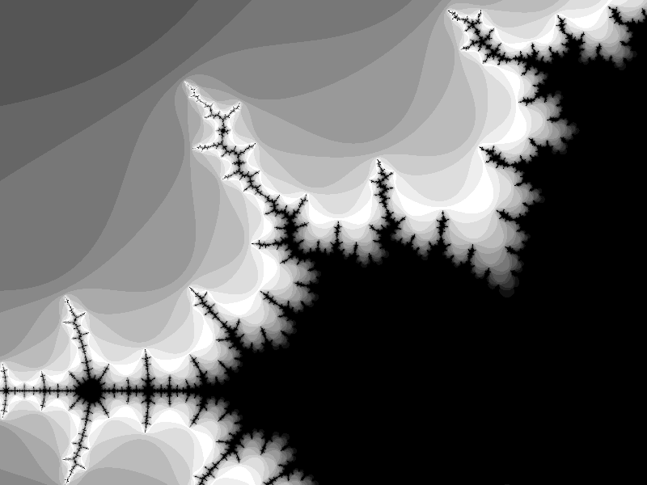

# Antaeus
> *I always saw a close kinship between the needs of "pure" mathematics and a certain hero of Greek mythology, Antaeus. The son of Earth, he had to touch the ground every so often in order to reestablish contact with his Mother; otherwise his strength waned. To strangle him, Hercules simply held him off the ground. Back to mathematics. Separation from any down-to-earth input could safely be complete for long periods — but not forever. In particular, the mathematical study of Brownian motion deserved a fresh contact with reality.*

A quick Mandelbrot Set renderer. I may add more later.

## Screenshots

## Controls
* [ : Decrease number of iterations
* ] : Increase number of iterations
* Arrow Keys: Pan camera
* Plus : Zoom in
* Minus : Zoom out

## Configuration
Add any whitespace separated hex values to a file called "COLORS". "COLORS" should be located in the same directory as your executable. A sample COLORS file has been provided.

## Ideas to fix current slowness:
* Effectively make use of GPU
* Find alternative ways of rendering (RGB maps?)
* Optimize the algorithms involved
* Save screen as texture, manipulate texture as you can

